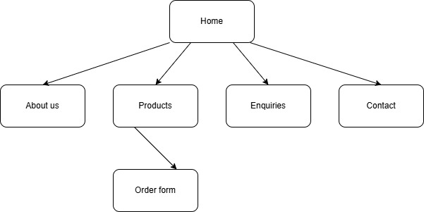

# Project Title
Synthe Wigs

## Student Information
**Student number:** ST10513841  
**Student Name:** Adivhaho Makwarela

## Project Overview

Snatche Wigs is a small beauty business that sells high quality wigs made from a blend
of synthetic and human hair. The business focuses on providing fashionable,
affordable, and easy to wear wigs for women who want to enhance their appearance
and confidence. The company started as a small online business selling wigs through
social media platforms and has grown due to increasing demand for stylish hair
solutions.

Mission:
To provide affordable, stylish, and high-quality wigs that help customers feel confident
and beautiful.

Vision:
To become a trusted wig brand known for quality products and excellent customer
service.

Target Audience:
• Women aged 18-35
• Students and Young working professionals
• Customers living in South Africa
• Customers looking for affordable wigs

## Website Goals and Objectives

The main goal of the website is to promote and sell wigs while building a strong brand
presence.
Objectives include:
• Increase online visibility and brand awareness.
• Provide customers with information about wig types and care.
• Allow customers to browse and buy wigs online.
• Build customer trust through reviews and testimonials.

Key Performance Indicators (KPIs):
• 1000+ visitors on the website within 3 months
• Atleast 30 online orders per month within the first 3 months
• Receive 10+ customer enquiries per month
• Social media traffic to the website by 15% within 3 months

## Timeline and Milestones

Week 1 (09-15 March 2026): Research and planning - Proposal and content research
Week 2 (16-22 March 2026): Wireframe design - sitemap and wireframes
Week 3 (23-29 March 2026): Website layout and development - Html pages
Week 4 - 6 (30 March - 19 April 2026): Testing and improvements - Website
Week 7 (20 April 2026: Website launch - Final Submission

## Sitemap

   

## References

-HostAfrica(2024) 
